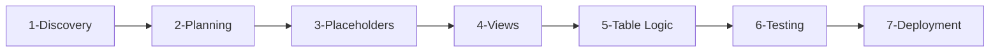
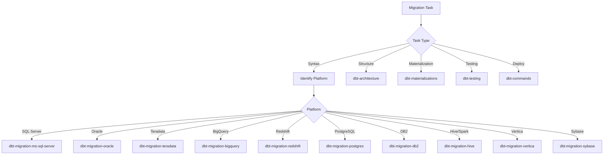

# Database to dbt Migration Workflow

## Purpose

Guide AI agents through the complete migration lifecycle from legacy database systems (SQL Server,
Oracle, Teradata, etc.) to production-quality dbt projects on Snowflake. This skill defines a
structured, repeatable process while delegating platform-specific syntax translation to dedicated
source-specific skills.

## When to Use This Skill

Activate this skill when users ask about:

- Planning a database migration to dbt
- Organizing legacy scripts for migration
- Creating placeholder models with correct datatypes
- Converting views and stored procedures to dbt models
- Testing migration results against source systems
- Deploying migrated dbt projects to production
- Understanding the overall migration workflow

For **platform-specific syntax translation**, delegate to:

- [`dbt-migration-ms-sql-server`](../dbt-migration-ms-sql-server/SKILL.md) - SQL Server / Azure
  Synapse T-SQL
- [`dbt-migration-oracle`](../dbt-migration-oracle/SKILL.md) - Oracle PL/SQL
- [`dbt-migration-teradata`](../dbt-migration-teradata/SKILL.md) - Teradata SQL and BTEQ
- [`dbt-migration-bigquery`](../dbt-migration-bigquery/SKILL.md) - Google BigQuery
- [`dbt-migration-redshift`](../dbt-migration-redshift/SKILL.md) - Amazon Redshift
- [`dbt-migration-postgres`](../dbt-migration-postgres/SKILL.md) - PostgreSQL / Greenplum / Netezza
- [`dbt-migration-db2`](../dbt-migration-db2/SKILL.md) - IBM DB2
- [`dbt-migration-hive`](../dbt-migration-hive/SKILL.md) - Hive / Spark / Databricks
- [`dbt-migration-vertica`](../dbt-migration-vertica/SKILL.md) - Vertica
- [`dbt-migration-sybase`](../dbt-migration-sybase/SKILL.md) - Sybase IQ

---

## Migration Workflow Overview

The migration process follows seven sequential phases. Each phase has entry criteria, deliverables,
and validation gates that must pass before advancing.



### Phase Activities

- **Phase 1 - Discovery**
  - Inventory source objects
  - Map dependencies
  - Document volumes
  - Assess complexity
- **Phase 2 - Planning**
  - Create folder structure
  - Map to medallion layers
  - Define naming rules
- **Phase 3 - Placeholders**
  - Create NULL cast models
  - Generate \_models.yml
  - Run compile test
  - Document schema
- **Phase 4 - Views**
  - Translate syntax
  - Apply CTE patterns
  - Add dbt tests
- **Phase 5 - Table Logic**
  - Analyze stored procedures
  - Convert to declarative SQL
  - Implement incremental patterns
- **Phase 6 - Testing**
  - Validate row counts
  - Compare checksums
  - Test business rules
  - Create mock data
- **Phase 7 - Deployment**
  - Deploy to dev
  - Run full validation
  - Document cutover plan
  - Deploy to production
  - Enable monitoring

### Phase Metadata for Agent Execution

<!-- AGENT_WORKFLOW_METADATA: Machine-parseable phase definitions -->

| Phase | ID             | Entry Criteria             | Exit Criteria                            | Primary Skill            | Delegation Trigger                                |
| ----- | -------------- | -------------------------- | ---------------------------------------- | ------------------------ | ------------------------------------------------- |
| 1     | `discovery`    | Migration request received | Inventory complete, dependencies mapped  | `dbt-migration`          | Source catalog queries → `dbt-migration-{source}` |
| 2     | `planning`     | Phase 1 complete           | Folder structure created, naming defined | `dbt-architecture`       | Always delegate structure decisions               |
| 3     | `placeholders` | Phase 2 complete           | All models compile with `where false`    | `dbt-migration`          | Datatype mapping → `dbt-migration-{source}`       |
| 4     | `views`        | Phase 3 complete           | All views converted and compile          | `dbt-migration-{source}` | Always delegate syntax translation                |
| 5     | `table_logic`  | Phase 4 complete           | All procedures converted                 | `dbt-materializations`   | ETL pattern analysis → this skill                 |
| 6     | `testing`      | Phase 5 complete           | All validation queries pass              | `dbt-testing`            | Always delegate test creation                     |
| 7     | `deployment`   | Phase 6 complete           | Production deployment successful         | `dbt-commands`           | Snowflake operations → `snowflake-cli`            |

### Skill Delegation Decision Tree



### Key Deliverables Per Phase

| Phase           | Deliverables                                | Validation Command                     |
| --------------- | ------------------------------------------- | -------------------------------------- |
| 1. Discovery    | `migration_inventory.csv`, dependency graph | Manual review                          |
| 2. Planning     | Folder structure, `_naming_conventions.md`  | `ls -la models/`                       |
| 3. Placeholders | `.sql` files, `_models.yml`                 | `dbt compile --select tag:placeholder` |
| 4. Views        | Converted view models                       | `dbt build --select tag:view`          |
| 5. Table Logic  | Converted procedure models                  | `dbt build --select tag:procedure`     |
| 6. Testing      | Validation queries, test results            | `dbt test --store-failures`            |
| 7. Deployment   | Production models, monitoring               | `dbt build --target prod`              |

---

## Phase 1: Discovery and Assessment

Create a complete inventory of source database objects and understand dependencies, volumes, and
complexity to inform migration planning.

### Phase 1 Activities

1. **Inventory source objects**: Query system catalogs for tables, views, procedures, functions
2. **Document dependencies**: Map object dependencies to determine migration order
3. **Assess complexity**: Categorize objects as Low/Medium/High/Custom complexity
4. **Create migration tracker**: Document objects in spreadsheet or issue tracker

### Complexity Assessment

| Complexity | Criteria                               | Examples                      |
| ---------- | -------------------------------------- | ----------------------------- |
| **Low**    | Simple SELECT, no/minimal joins        | Lookup tables, simple views   |
| **Medium** | Multiple joins, aggregations, CASE     | Summary views, report queries |
| **High**   | Procedural logic, cursors, temp tables | SCD procedures, bulk loads    |
| **Custom** | Platform-specific features             | Wrapped code, CLR functions   |

### Phase 1 Skill References

| Activity               | Delegate To                                  |
| ---------------------- | -------------------------------------------- |
| System catalog queries | `dbt-migration-{source}` (platform-specific) |
| Dependency analysis    | `dbt-migration-{source}`                     |

### Phase 1 Checklist

- [ ] All tables, views, procedures inventoried
- [ ] Row counts documented
- [ ] Object dependencies mapped
- [ ] Complexity assessment complete
- [ ] Migration tracker created
- [ ] Refresh frequencies identified

---

## Phase 2: Planning and Organization

Organize legacy scripts, map objects to the dbt medallion architecture, and establish naming
conventions before any conversion begins.

### Phase 2 Activities

1. **Organize legacy scripts**: Create folder structure (tables/, views/, stored_procedures/,
   functions/)
2. **Map to medallion layers**: Assign objects to Bronze/Silver/Gold with appropriate prefixes
3. **Define naming conventions**: Follow [`dbt-architecture`](../dbt-architecture/SKILL.md) skill
   patterns
4. **Create dependency graph**: Visualize migration order
5. **Establish validation criteria**: Define success metrics per object

### Layer Mapping Reference

| Source Object Type   | Target Layer | dbt Prefix | Materialization |
| -------------------- | ------------ | ---------- | --------------- |
| Source tables (raw)  | Bronze       | `stg_`     | ephemeral       |
| Simple views         | Bronze       | `stg_`     | ephemeral       |
| Complex views        | Silver       | `int_`     | ephemeral/table |
| Dimension procedures | Gold         | `dim_`     | table           |
| Fact procedures      | Gold         | `fct_`     | incremental     |

### Phase 2 Skill References

| Activity                | Delegate To                                                |
| ----------------------- | ---------------------------------------------------------- |
| Project structure       | [`dbt-architecture`](../dbt-architecture/SKILL.md)         |
| Naming conventions      | [`dbt-architecture`](../dbt-architecture/SKILL.md)         |
| Materialization choices | [`dbt-materializations`](../dbt-materializations/SKILL.md) |

### Phase 2 Checklist

- [ ] Legacy scripts organized in folders
- [ ] All objects mapped to medallion layers
- [ ] Naming conventions documented
- [ ] Dependency graph created
- [ ] Migration order established
- [ ] Validation criteria defined

---

## Phase 3: Create Placeholder Models

Create empty dbt models with correct column names, data types, and schema documentation **before**
adding any transformation logic. This establishes the contract for downstream consumers.

### Phase 3 Activities

1. **Generate placeholder models**: Create SQL files with `null::datatype as column_name` pattern
   and `where false`
2. **Map datatypes**: Use platform-specific skill for datatype conversion to Snowflake types
3. **Create schema documentation**: Generate `_models.yml` with column descriptions and tests
4. **Validate compilation**: Run `dbt compile --select tag:placeholder`
5. **Track status**: Add `placeholder` tag to config for tracking

### Placeholder Model Pattern

```sql
{{ config(materialized='ephemeral', tags=['placeholder', 'bronze']) }}

select
    null::integer as column_id,
    null::varchar(100) as column_name,
    -- ... additional columns with explicit types
where false
```

### Phase 3 Skill References

| Activity           | Delegate To                                        |
| ------------------ | -------------------------------------------------- |
| Datatype mapping   | dbt-migration-{source} (platform-specific)         |
| YAML structure     | [`dbt-testing`](../dbt-testing/SKILL.md)           |
| Test definitions   | [`dbt-testing`](../dbt-testing/SKILL.md)           |
| Naming conventions | [`dbt-architecture`](../dbt-architecture/SKILL.md) |

### Phase 3 Checklist

- [ ] Placeholder model created for each target table
- [ ] All columns have explicit datatype casts
- [ ] Column names follow naming conventions
- [ ] `_models.yml` created with descriptions and tests
- [ ] All placeholder models compile successfully
- [ ] Placeholder tag applied for tracking

---

## Phase 4: Convert Views

Convert source database views to dbt models, starting with simple views before tackling complex
ones. Views are typically easier than stored procedures as they contain declarative SQL.

### Phase 4 Activities

1. **Prioritize by complexity**: Simple views (no joins) → Join views → Aggregate views → Complex
   views
2. **Apply syntax translation**: Delegate to platform-specific skill (see Related Skills)
3. **Structure with CTEs**: Use standard CTE pattern from [`dbt-modeling`](../dbt-modeling/SKILL.md)
   skill
4. **Add tests**: Define tests in `_models.yml` using [`dbt-testing`](../dbt-testing/SKILL.md) skill
   patterns
5. **Replace placeholder logic**: Update placeholder SELECT with converted logic

### Phase 4 Skill References

| Activity           | Delegate To                                       |
| ------------------ | ------------------------------------------------- |
| Syntax translation | dbt-migration-{source} (SQL Server, Oracle, etc.) |
| CTE patterns       | [`dbt-modeling`](../dbt-modeling/SKILL.md)        |
| Test definitions   | [`dbt-testing`](../dbt-testing/SKILL.md)          |

### Phase 4 Checklist

- [ ] Views prioritized by complexity
- [ ] Platform-specific syntax translated (delegate to source skills)
- [ ] CTE pattern applied consistently
- [ ] dbt tests added for each view
- [ ] Converted views compile successfully
- [ ] Inline comments document syntax changes

---

## Phase 5: Convert Table Logic from Stored Procedures

Transform procedural stored procedure logic into declarative dbt models, selecting appropriate
materializations for different ETL patterns.

### Phase 5 Activities

1. **Analyze ETL patterns**: Identify Full Refresh, SCD Type 1/2, Append, Delete+Insert patterns
2. **Map to materializations**: Use pattern-to-materialization mapping from
   [`dbt-materializations`](../dbt-materializations/SKILL.md) skill
3. **Break complex procedures**: Split single procedures into multiple intermediate/final models
4. **Convert procedural constructs**: Replace cursors, temp tables, variables with declarative SQL
5. **Document decisions**: Add header comments explaining conversion approach

### Pattern Mapping Reference

| Source Pattern         | dbt Approach                                |
| ---------------------- | ------------------------------------------- |
| TRUNCATE + INSERT      | `materialized='table'`                      |
| UPDATE + INSERT (SCD1) | `materialized='incremental'` with merge     |
| SCD Type 2             | dbt snapshot or custom incremental          |
| INSERT only            | `materialized='incremental'` append         |
| DELETE range + INSERT  | `incremental` with `delete+insert` strategy |

### Procedural to Declarative Conversion

| Procedural Pattern | dbt Equivalent                   |
| ------------------ | -------------------------------- |
| CURSOR loop        | Window function or recursive CTE |
| Temp tables        | CTEs or intermediate models      |
| Variables          | Jinja variables or macros        |
| IF/ELSE branches   | CASE expressions or ``   |
| TRY/CATCH          | Pre-validation tests             |

### Phase 5 Skill References

| Activity                  | Delegate To                                                |
| ------------------------- | ---------------------------------------------------------- |
| Materialization selection | [`dbt-materializations`](../dbt-materializations/SKILL.md) |
| Incremental strategies    | [`dbt-materializations`](../dbt-materializations/SKILL.md) |
| Snapshot configuration    | [`dbt-materializations`](../dbt-materializations/SKILL.md) |
| Syntax translation        | dbt-migration-{source}                                     |
| Model structure           | [`dbt-modeling`](../dbt-modeling/SKILL.md)                 |

### Phase 5 Checklist

- [ ] All stored procedures analyzed for patterns
- [ ] ETL patterns mapped to dbt materializations
- [ ] Complex procedures broken into multiple models
- [ ] Procedural logic converted to declarative SQL
- [ ] Conversion decisions documented in model headers
- [ ] All converted models compile successfully

---

## Phase 6: End-to-End Testing and Validation

Verify that migrated dbt models produce identical results to source system, using multiple
validation techniques to ensure data integrity.

### Phase 6 Activities

1. **Row count validation**: Compare total counts between source and target
2. **Column checksum validation**: Compare row-level hashes to identify differences
3. **Business rule validation**: Verify calculated fields match source logic
4. **Aggregate validation**: Compare summary metrics (sums, counts, averages)
5. **Mock data testing**: Create seed fixtures for complex transformation testing
6. **Incremental validation**: Test both full-refresh and incremental runs
7. **Document results**: Create validation report for each migrated object

### Validation Techniques

| Technique      | Purpose                   | Implementation                |
| -------------- | ------------------------- | ----------------------------- |
| Row counts     | Detect missing/extra rows | Compare COUNT(\*)             |
| Checksums      | Detect value differences  | SHA2 hash comparison          |
| Business rules | Verify logic accuracy     | Singular tests                |
| Aggregates     | Validate totals           | SUM/AVG comparisons           |
| Mock data      | Test transformations      | Seed files + expected outputs |

### Phase 6 Skill References

| Activity         | Delegate To                                |
| ---------------- | ------------------------------------------ |
| Test definitions | [`dbt-testing`](../dbt-testing/SKILL.md)   |
| Constraint tests | [`dbt-testing`](../dbt-testing/SKILL.md)   |
| Singular tests   | [`dbt-testing`](../dbt-testing/SKILL.md)   |
| dbt commands     | [`dbt-commands`](../dbt-commands/SKILL.md) |

### Phase 6 Checklist

- [ ] Row count validation queries created
- [ ] Checksum comparison implemented
- [ ] Business rule tests written
- [ ] Aggregate metrics compared
- [ ] Incremental models tested (full refresh + incremental)
- [ ] All validation queries pass
- [ ] Discrepancies documented and resolved
- [ ] Validation report completed

---

## Phase 7: Deployment and Cutover

Deploy validated dbt models to production with a clear cutover plan and monitoring strategy.

### Phase 7 Activities

1. **Deploy to Development**: Run `dbt build --target dev` and validate
2. **Deploy to Test/UAT**: Run full validation suite with `--store-failures`
3. **Create cutover plan**: Document pre-cutover, cutover, post-cutover, and rollback steps
4. **Deploy to Production**: Execute deployment with production data
5. **Configure scheduled runs**: Set up Snowflake tasks or dbt Cloud scheduling
6. **Monitor post-deployment**: Track run duration, row counts, test failures, performance

### Cutover Plan Template

| Phase              | Activities                                                                     |
| ------------------ | ------------------------------------------------------------------------------ |
| Pre-Cutover (T-1)  | Final validation, stakeholder sign-off, rollback docs, user communication      |
| Cutover (T-0)      | Disable source ETL, final sync, deploy, build, validate, update BI connections |
| Post-Cutover (T+1) | Monitor performance, verify schedules, confirm access, close tickets           |
| Rollback           | Re-enable source ETL, revert BI connections, document issues                   |

### Phase 7 Skill References

| Activity           | Delegate To                                                          |
| ------------------ | -------------------------------------------------------------------- |
| dbt commands       | [`dbt-commands`](../dbt-commands/SKILL.md)                           |
| Project deployment | [`dbt-projects-on-snowflake`](../dbt-projects-on-snowflake/SKILL.md) |
| Snowflake tasks    | [`snowflake-cli`](../snowflake-cli/SKILL.md)                         |
| Run monitoring     | [`dbt-artifacts`](../dbt-artifacts/SKILL.md)                         |
| Connection setup   | [`snowflake-connections`](../snowflake-connections/SKILL.md)         |

### Phase 7 Checklist

- [ ] Development deployment successful
- [ ] Test/UAT deployment successful
- [ ] Cutover plan documented
- [ ] Rollback procedure documented
- [ ] Stakeholder sign-off obtained
- [ ] Production deployment successful
- [ ] Scheduled runs configured
- [ ] Monitoring set up
- [ ] Migration marked complete

---

## Related Skills

### Workflow Skills

- **[dbt-architecture](../dbt-architecture/SKILL.md)**: Project structure, medallion layers, naming
  conventions
- **[dbt-modeling](../dbt-modeling/SKILL.md)**: CTE patterns, SQL structure, layer-specific
  templates
- **[dbt-testing](../dbt-testing/SKILL.md)**: Data quality tests, dbt_constraints, singular tests
- **[dbt-materializations](../dbt-materializations/SKILL.md)**: Incremental strategies, snapshots,
  Python models
- **[dbt-performance](../dbt-performance/SKILL.md)**: Clustering keys, warehouse sizing, query
  optimization
- **[dbt-commands](../dbt-commands/SKILL.md)**: dbt CLI operations, model selection syntax
- **[dbt-core](../dbt-core/SKILL.md)**: Installation, configuration, package management
- **[snowflake-cli](../snowflake-cli/SKILL.md)**: Snowflake operations, deployment commands

### Platform-Specific Translation Skills

For syntax translation, delegate to the appropriate source-specific skill:

| Source Platform            | Skill Name                                                               | Key Considerations                   |
| -------------------------- | ------------------------------------------------------------------------ | ------------------------------------ |
| SQL Server / Azure Synapse | [`dbt-migration-ms-sql-server`](../dbt-migration-ms-sql-server/SKILL.md) | T-SQL, IDENTITY, TOP, #temp tables   |
| Oracle                     | [`dbt-migration-oracle`](../dbt-migration-oracle/SKILL.md)               | PL/SQL, ROWNUM, CONNECT BY, packages |
| Teradata                   | [`dbt-migration-teradata`](../dbt-migration-teradata/SKILL.md)           | QUALIFY, BTEQ, volatile tables       |
| BigQuery                   | [`dbt-migration-bigquery`](../dbt-migration-bigquery/SKILL.md)           | UNNEST, STRUCT/ARRAY, backticks      |
| Redshift                   | [`dbt-migration-redshift`](../dbt-migration-redshift/SKILL.md)           | DISTKEY/SORTKEY, COPY/UNLOAD         |
| PostgreSQL                 | [`dbt-migration-postgres`](../dbt-migration-postgres/SKILL.md)           | Array expressions, psql commands     |
| DB2                        | [`dbt-migration-db2`](../dbt-migration-db2/SKILL.md)                     | SQL PL, FETCH FIRST, handlers        |
| Hive/Spark                 | [`dbt-migration-hive`](../dbt-migration-hive/SKILL.md)                   | External tables, PARTITIONED BY      |
| Vertica                    | [`dbt-migration-vertica`](../dbt-migration-vertica/SKILL.md)             | Projections, flex tables             |
| Sybase                     | [`dbt-migration-sybase`](../dbt-migration-sybase/SKILL.md)               | T-SQL variant, SELECT differences    |

---

## Quick Reference: Phase Summary

| Phase           | Key Deliverable                      | Primary Skill                                                                |
| --------------- | ------------------------------------ | ---------------------------------------------------------------------------- |
| 1. Discovery    | Object inventory, dependency map     | This skill                                                                   |
| 2. Planning     | Folder structure, naming conventions | [dbt-architecture](../dbt-architecture/SKILL.md)                             |
| 3. Placeholders | Models with datatypes, schema.yml    | This skill                                                                   |
| 4. Views        | Converted view models                | dbt-migration-{source}                                                       |
| 5. Table Logic  | Converted procedure models           | [dbt-materializations](../dbt-materializations/SKILL.md)                     |
| 6. Testing      | Validation queries, test results     | [dbt-testing](../dbt-testing/SKILL.md)                                       |
| 7. Deployment   | Production deployment, monitoring    | [dbt-core](../dbt-core/SKILL.md), [snowflake-cli](../snowflake-cli/SKILL.md) |

---

## Validation Hook Integration

Validation hooks automatically enforce quality standards when models are written or edited.

### Quality Gates

Before advancing to each phase, ensure:

1. **All models compile**: `dbt compile`
2. **Validation hooks pass**: Check Claude output for errors
3. **Tests pass**: `dbt test`
4. **Documentation complete**: `dbt docs generate`

### Validation by Phase

| Phase   | Focus Areas                                   |
| ------- | --------------------------------------------- |
| Phase 3 | YAML structure, column definitions, naming    |
| Phase 4 | Syntax translation, CTE patterns, ref() usage |
| Phase 5 | Incremental configs, materialization patterns |
| Phase 6 | Test coverage, constraint definitions         |

Hook configuration and detailed validation rules are defined in `.claude/settings.local.json`.
