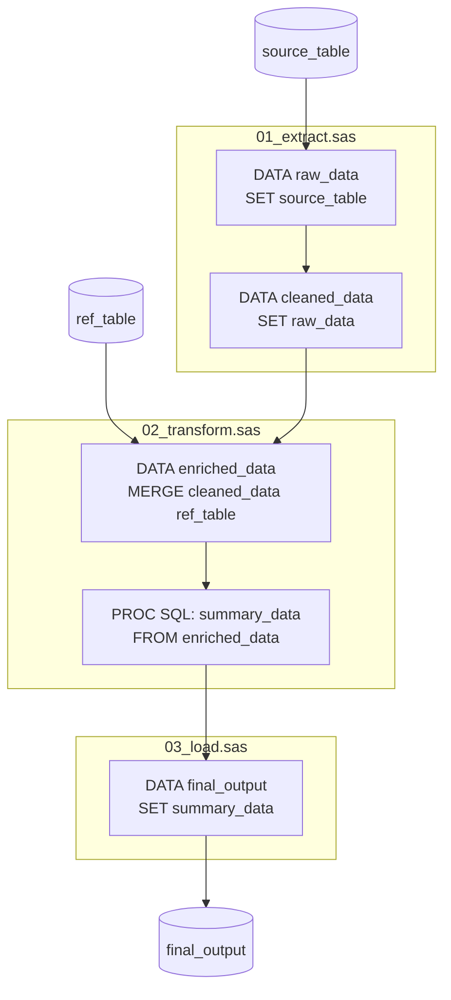
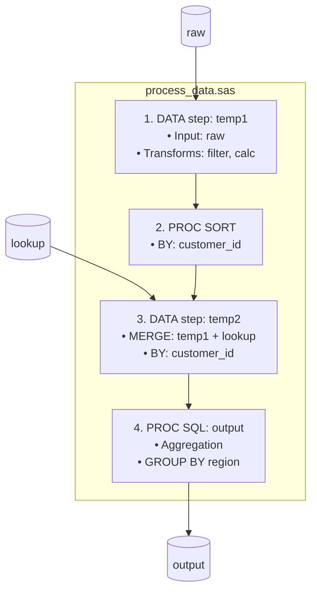
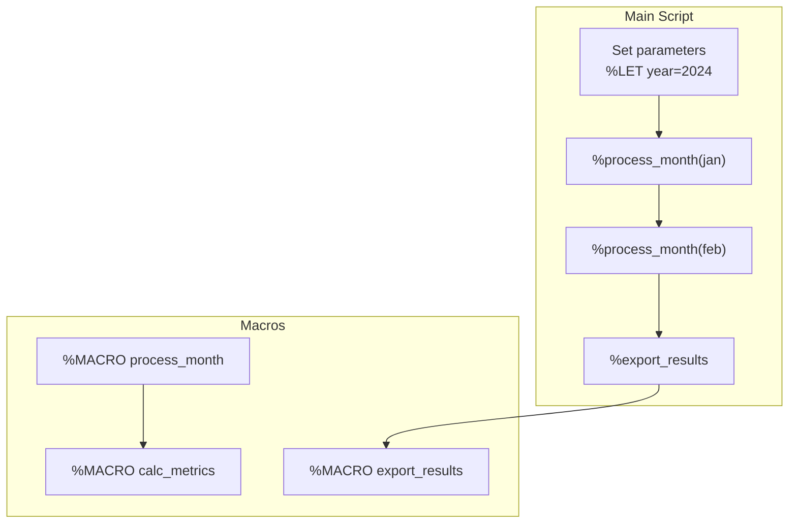
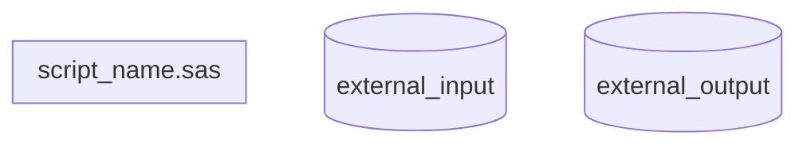
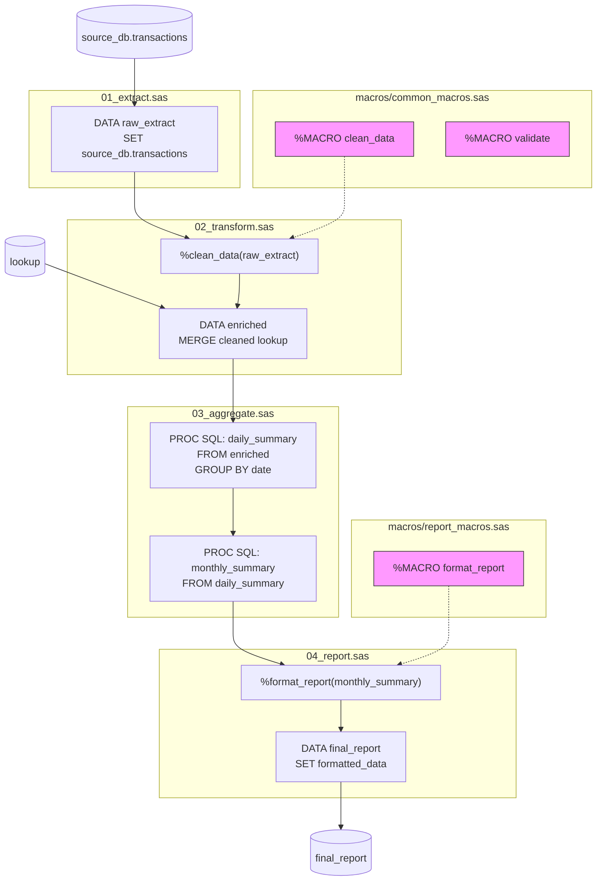
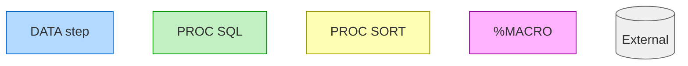

# SAS Dependency Mermaid Diagrams

## When to Load

Load when user requests:
- Dependency diagram / visualization
- Data flow analysis
- Script interaction mapping
- Codebase structure overview

---

## Diagram Types

### 1. Script-Level Dependency Diagram

Shows how SAS scripts interact through shared datasets:



### 2. Block-Level Flow (Single Script)

Shows DATA steps and PROCs within one script:



### 3. Macro Dependency Diagram

Shows macro calls and dependencies:



---

## Generation Rules

### Node Naming Convention

| Block Type | Node Format |
|------------|-------------|
| DATA step | `"DATA: output_table<br/>SET: input_table"` |
| PROC SQL | `"PROC SQL: table_name<br/>FROM: source"` |
| PROC SORT | `"PROC SORT<br/>DATA=input OUT=output<br/>BY: vars"` |
| PROC MEANS | `"PROC MEANS<br/>DATA=input<br/>OUTPUT: stats"` |
| Macro | `"%MACRO name(params)"` |
| Macro call | `"%macro_name(args)"` |

### Edge Rules

1. **Data dependency**: Input table → Processing block
2. **Output flow**: Processing block → Output table
3. **Sequential**: Block N → Block N+1 (if no explicit dependency)
4. **Macro calls**: Calling block → Macro definition

### Subgraph Organization



---

## Extracting Dependencies from SAS Code

### DATA Step Dependencies

```sas
DATA output_table;
  SET input_table1 input_table2;    /* Inputs */
  MERGE table_a table_b;            /* Also inputs */
  BY key_var;
RUN;
```

**Extract:**
- Outputs: `output_table`
- Inputs: `input_table1`, `input_table2`, `table_a`, `table_b`
- BY vars: `key_var`

### PROC SQL Dependencies

```sas
PROC SQL;
  CREATE TABLE output_sql AS
  SELECT a.*, b.field
  FROM table_a a
  LEFT JOIN table_b b ON a.key = b.key;
QUIT;
```

**Extract:**
- Output: `output_sql`
- Inputs: `table_a`, `table_b`

### Macro Dependencies

```sas
%MACRO process(input=, output=);
  DATA &output;
    SET &input;
  RUN;
%MEND;

%process(input=raw_data, output=processed_data);
```

**Extract:**
- Macro: `process` with params `input`, `output`
- Call resolves to: input=`raw_data`, output=`processed_data`

---

## Complex Example

**Input SAS files:**

```
project/
├── 01_extract.sas       # Extracts from source
├── 02_transform.sas     # Cleans and enriches
├── 03_aggregate.sas     # Creates summaries
├── macros/
│   ├── common_macros.sas
│   └── report_macros.sas
└── 04_report.sas        # Generates final output
```

**Generated Mermaid:**



---

## Presentation Tips

1. **Start simple**: Show high-level script dependencies first
2. **Drill down**: Offer to expand individual scripts
3. **Highlight complexity**: Use colors for complex blocks (RETAIN, ARRAY)
4. **Mark external**: Use cylinder shapes `[( )]` for external tables
5. **Show macros**: Use dotted lines `-..->` for macro dependencies

---

## Color Coding (Optional)



| Color | Meaning |
|-------|---------|
| Blue | DATA step |
| Green | PROC SQL |
| Yellow | PROC SORT/MEANS/FREQ |
| Pink | Macro |
| Gray | External table |
