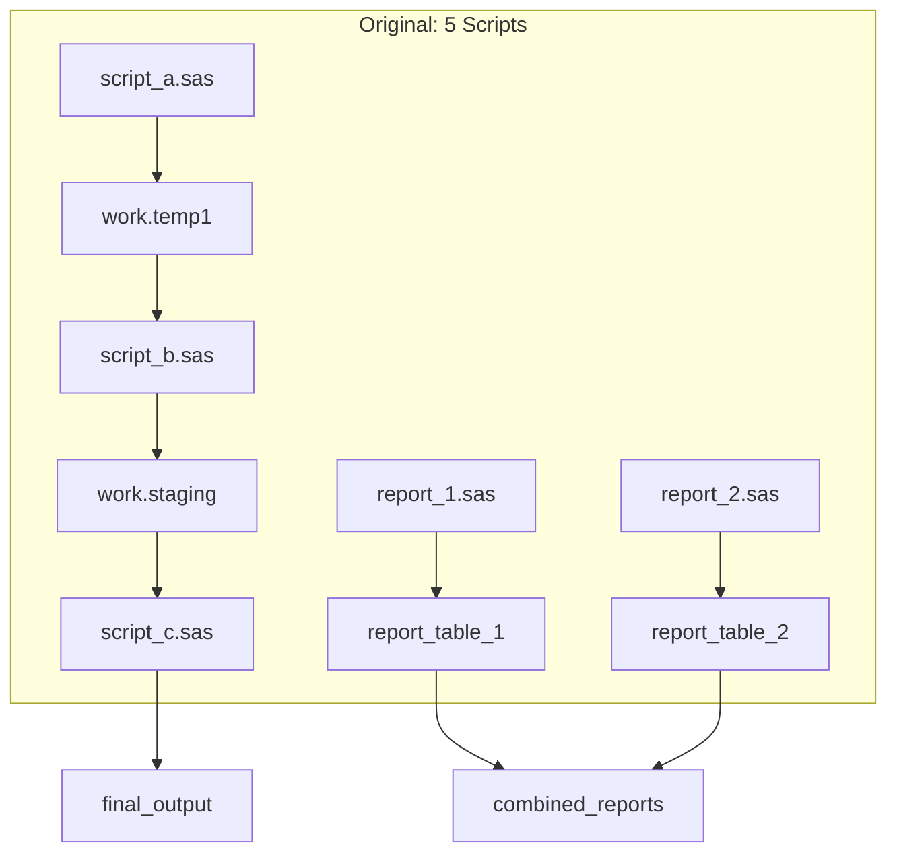
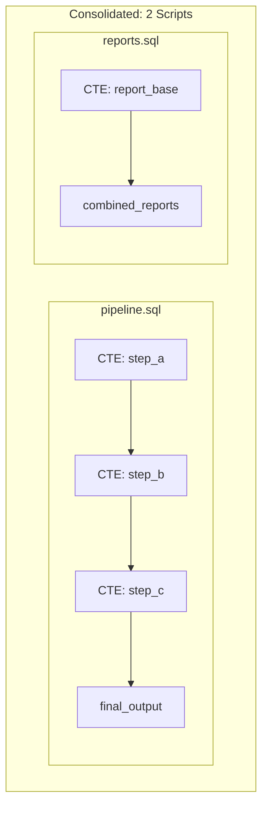

# Consolidation Report Template

Use this template when presenting Optimize & Consolidate mode results.

---

## Consolidation Summary

```markdown
## Consolidation Summary

**Source Directory:** `{source_path}`
**Target Schema:** `{target_schema}`
**Migration Mode:** Optimize & Consolidate

### Input → Output Mapping

| Original Scripts | Consolidated Output | Consolidation Type |
|------------------|---------------------|-------------------|
| {script_a}, {script_b} | pipeline.sql | Sequential merge |
| {report_1}, {report_2} | reports.sql | Shared source |
| {standalone} | standalone.sql | No change (standalone) |

### Metrics

| Metric | Before | After | Savings |
|--------|--------|-------|---------|
| **Total Files** | {input_count} | {output_count} | {reduction}% |
| **Total Tables** | {tables_before} | {tables_after} | {tables_saved} |
| **Lines of Code** | {loc_before} | {loc_after} | {loc_saved} |
| **PROC SORTs** | {sorts_before} | {sorts_after} | {sorts_saved} |
```

---

## Consolidation Actions Taken

```markdown
## Consolidation Actions

### Scripts Merged

| Group | Scripts | Merge Reason | Target |
|-------|---------|--------------|--------|
| 1 | script_a.sas, script_b.sas | Sequential: A.output = B.input | pipeline.sql |
| 2 | report_1.sas, report_2.sas | Shared source table | reports.sql |

### Tables Eliminated (→ CTEs)

| Original Table | Used In | Converted To |
|----------------|---------|--------------|
| work.temp1 | script_a.sas only | CTE `temp1` |
| work.staging | script_b.sas only | CTE `staging` |
| work.intermediate | script_a, script_b | CTE `intermediate` |

### Redundancy Removed

| Redundant Code | Occurrences | Action |
|----------------|-------------|--------|
| `PROC SORT DATA=customers BY id` | 5 scripts | Single sorted view |
| `DATA work.lookup` (identical) | 3 scripts | Single table |
| `%include 'common.sas'` | 4 scripts | Inlined once |

### Macros Inlined

| Macro | Called From | Action |
|-------|-------------|--------|
| %calc_metrics | script_a.sas only | Inlined |
| %format_date | 2 scripts | Kept as UDF |
```

---

## Traceability Matrix

```markdown
## Traceability Matrix

**Purpose:** Map every original SAS block to its location in consolidated output.

### pipeline.sql

| Source File | Source Block | Line # | Target Location | Notes |
|-------------|--------------|--------|-----------------|-------|
| script_a.sas | DATA step 1 | 10-25 | CTE `step_a` (lines 5-15) | Direct translation |
| script_a.sas | PROC SQL 1 | 27-35 | CTE `step_b` (lines 17-25) | Merged with script_b |
| script_b.sas | DATA step 1 | 5-20 | CTE `step_b` (lines 17-25) | Merged with script_a |
| script_b.sas | DATA step 2 | 22-40 | Final SELECT (lines 27-45) | Output table |

### reports.sql

| Source File | Source Block | Line # | Target Location | Notes |
|-------------|--------------|--------|-----------------|-------|
| report_1.sas | PROC SQL 1 | 5-30 | CTE `report_base` | Combined source |
| report_2.sas | PROC SQL 1 | 5-25 | CTE `report_base` | UNION with report_1 |
| report_1.sas | DATA step 1 | 32-50 | CASE WHEN block | Conditional merge |
| report_2.sas | DATA step 1 | 27-45 | CASE WHEN block | Conditional merge |
```

---

## Dependency Diagram

```markdown
## Dependency Visualization

### Original Structure (Before)



### Consolidated Structure (After)


```

---

## Consolidated Code Output

```markdown
## Snowflake SQL Output

### File: pipeline.sql

**Consolidates:** script_a.sas, script_b.sas, script_c.sas

```sql
-- ============================================================
-- Consolidated Pipeline
-- Source: script_a.sas, script_b.sas, script_c.sas
-- Generated: {timestamp}
-- ============================================================

CREATE OR REPLACE TABLE {schema}.final_output AS

-- Step A (from script_a.sas, lines 10-25)
WITH step_a AS (
    SELECT 
        col1,
        col2,
        -- transformation logic from script_a
    FROM source_table
    WHERE condition
),

-- Step B (from script_a.sas lines 27-35 + script_b.sas lines 5-20)
step_b AS (
    SELECT 
        a.*,
        -- combined logic from both scripts
    FROM step_a a
),

-- Step C (from script_b.sas lines 22-40)
step_c AS (
    SELECT 
        *,
        -- final transformation
    FROM step_b
)

SELECT * FROM step_c;
```

### File: reports.sql

**Consolidates:** report_1.sas, report_2.sas

```sql
-- ============================================================
-- Consolidated Reports
-- Source: report_1.sas, report_2.sas
-- Generated: {timestamp}
-- ============================================================

CREATE OR REPLACE TABLE {schema}.combined_reports AS

WITH report_base AS (
    -- Combined from report_1 and report_2
    SELECT *, 'report_1' AS source FROM source_for_report_1
    UNION ALL
    SELECT *, 'report_2' AS source FROM source_for_report_2
)

SELECT 
    *,
    CASE WHEN source = 'report_1' THEN calc_1 END AS report_1_metric,
    CASE WHEN source = 'report_2' THEN calc_2 END AS report_2_metric
FROM report_base;
```
```

---

## Validation Results

```markdown
## Validation

### Compile Status

| File | Status | Errors |
|------|--------|--------|
| pipeline.sql | ✅ Compiled | None |
| reports.sql | ✅ Compiled | None |

### Behavioral Verification

| Check | Status | Notes |
|-------|--------|-------|
| Row counts match | ✅ | final_output: {n} rows |
| Column schema match | ✅ | All columns preserved |
| Data values match | ⚠️ | Minor float precision differences |

### Differences from Original

- **Execution order:** CTEs execute in dependency order (same logical result)
- **Intermediate tables:** No longer persisted (converted to CTEs)
- **Performance:** Expected improvement due to reduced I/O
```

---

## Recommendations

```markdown
## Post-Migration Recommendations

### Immediate Actions
1. [ ] Review traceability matrix with stakeholders
2. [ ] Run data validation tests
3. [ ] Update documentation/runbooks

### Future Optimization
1. Consider converting `reports.sql` to Dynamic Table for auto-refresh
2. Add clustering on `final_output` for query performance
3. Schedule consolidated pipeline via Snowflake Tasks

### Monitoring
- Set up query history monitoring for consolidated scripts
- Compare execution times: original vs consolidated
```
