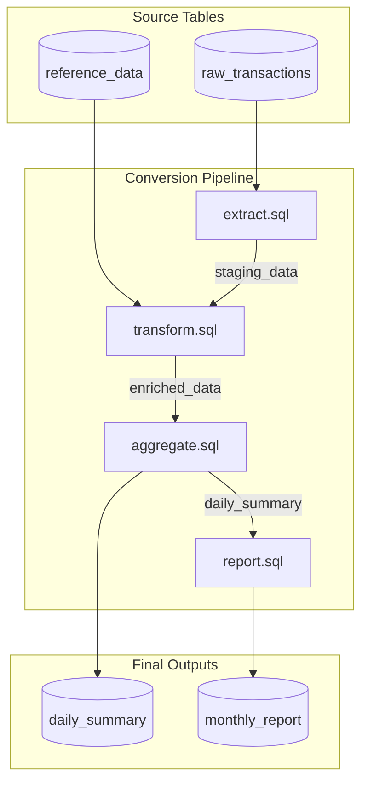
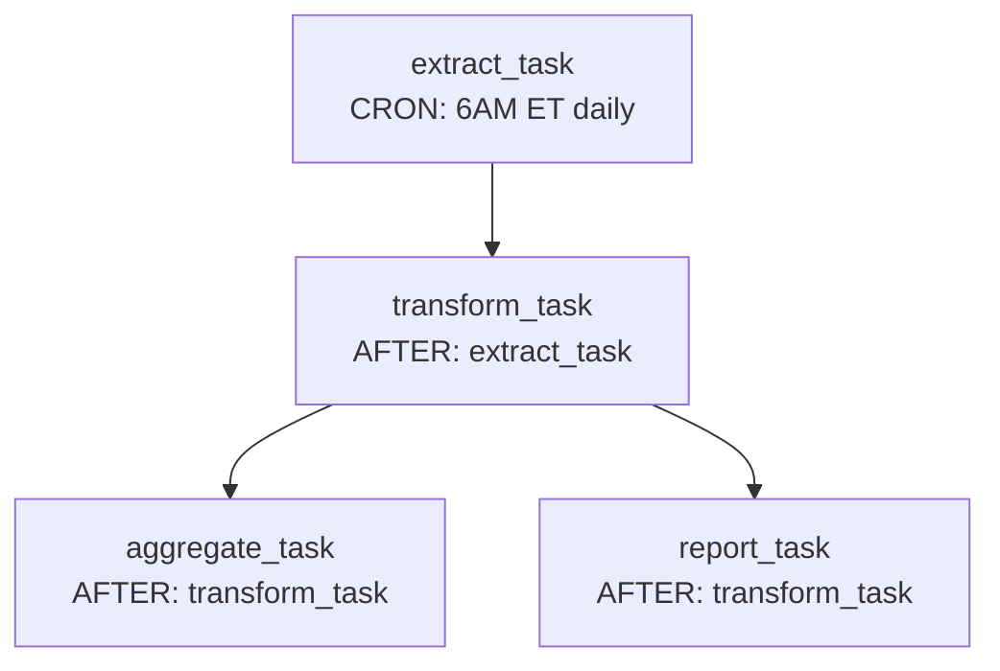

# Conversion Report Template

Generate this report at the end of every conversion session. The report summarizes all files converted, flags issues, provides dependency diagrams, and recommends orchestration.

---

## Report Structure

### Section 1: Conversion Summary

```markdown
# SAS to Snowflake Conversion Report

**Date:** {date}
**Migration Mode:** {1:1 Direct | 1:1 SQL Focus | Optimize & Consolidate}
**Target Schema:** {DATABASE.SCHEMA}

## Conversion Summary

| Metric | Value |
|--------|-------|
| SAS files processed | {count} |
| Total SAS blocks analyzed | {count} |
| Snowflake SQL files generated | {count} |
| Stored procedures generated | {count} |
| PySpark/SCOS notebooks generated | {count} |
| Total output artifacts | {count} |

### Per-File Summary

| SAS File | Blocks | Tier Distribution | Output File | Compile Status | Test Status |
|----------|--------|-------------------|-------------|----------------|-------------|
| extract.sas | 4 | 3 SQL, 1 SP | extract.sql | PASS | PASS |
| transform.sas | 6 | 4 SQL, 2 SP | transform.sql | PASS | FAIL (row count) |
| model.sas | 3 | 1 SQL, 2 PySpark | model.ipynb | PASS | NOT TESTED |
```

**PRE-CONDITION**: Read `compilation_results.json` before populating Compile Status column.
- If file exists with `"status": "SKIPPED BY USER"` -> Compile Status = "SKIPPED"
- If file exists with pass/fail data -> Compile Status = "PASS" or "FAIL"
- If file does not exist -> Compile Status = "NOT PERFORMED" and print WARNING: `"compilation_results.json not found"`

#### Compilation Status Summary (Batch Mode)

When batch mode is used (10+ files), include an aggregate compilation summary by pipeline phase:

```markdown
### Compilation Status

| Phase | Files | Compiled | Passed | Failed | Error Categories |
|-------|-------|----------|--------|--------|------------------|
| 01 - Import | 38 | 38 | 36 | 2 | Missing table ref (2) |
| 02 - Transform | 45 | 45 | 44 | 1 | Syntax error (1) |
| 03 - Aggregate | 30 | 30 | 30 | 0 | — |
| 04 - Report | 25 | 25 | 23 | 2 | Type mismatch (1), Missing UDF (1) |
| **Total** | **138** | **138** | **133** | **5** | |

**Compilation Rate:** 96.4% (133/138 passed)

#### Failed Compilations Detail

| File | Phase | Error | Root Cause | Suggested Fix |
|------|-------|-------|-----------|---------------|
| 1-05_import_rates.sql | 01 | Object 'RATE_TABLE' does not exist | External source not stubbed | Add stub DDL or provide source table |
| 1-38_import_overrides.sql | 01 | Object 'OVERRIDE_DATA' does not exist | External source not stubbed | Add stub DDL or provide source table |
| 2-12_calc_spread.sql | 02 | Unexpected 'DECLARE' | Missing BEGIN/END wrapper | Wrap in stored procedure block |
| 4-03_report_monthly.sql | 04 | Incompatible types VARCHAR and NUMBER | Implicit SAS type coercion | Add explicit CAST() |
| 4-18_report_summary.sql | 04 | Function 'CUSTOM_UDF' does not exist | UDF not yet created | Create UDF stub or convert from SAS macro |
```

---

### Section 2: Difficult and Unremediated Blocks

Flag every block that meets any of these criteria:
- Classified as Tier 3 (PySpark/SCOS)
- Confidence level is LOW or MEDIUM
- Contains `MANUAL_REVIEW_REQUIRED` markers
- Contains `%INCLUDE` without source available
- Contains external database LIBNAME (Oracle, DB2, Teradata, etc.)
- Contains HASH objects, CALL EXECUTE, or complex SYMPUT chains
- Contains statistical procs (PROC REG, GLM, LOGISTIC, etc.)
- Post-generation self-check flagged an issue that was NOT auto-fixed

```markdown
## Difficult / Unremediated Blocks

| File | Block | Lines | Construct | Issue | Severity | Status |
|------|-------|-------|-----------|-------|----------|--------|
| transform.sas | 5 | 82-110 | HASH object | No SQL equivalent; converted to PySpark SCOS | HIGH | Converted (PySpark) |
| model.sas | 2 | 15-60 | PROC REG | Statistical regression; needs ML library | HIGH | Converted (PySpark) |
| extract.sas | 3 | 40-55 | %INCLUDE 'missing.sas' | Source file not available; stub generated | HIGH | MANUAL REVIEW |
| transform.sas | 3 | 45-70 | MERGE many-to-many | SAS MERGE vs SQL JOIN semantics differ | MEDIUM | Converted (flagged) |
| report.sas | 2 | 20-35 | INTNX alignment | SAS alignment=S vs Snowflake DATEADD | MEDIUM | Converted (verify dates) |
| load.sas | 4 | 60-80 | LIBNAME Oracle | Oracle passthrough SQL converted; verify syntax | MEDIUM | Converted (verify) |

### Severity Guide

| Severity | Meaning | Action Required |
|----------|---------|-----------------|
| HIGH | Cannot be fully automated; requires human review | Manual review and testing before production |
| MEDIUM | Converted but semantics may differ subtly | Verify with test data |
| LOW | Minor style or preference difference | Optional review |
```

---

### Section 3: Testing Results

Report results from validation testing (if performed). Flag all failures.

```markdown
## Testing Results

### Overall

| Status | Count |
|--------|-------|
| PASSED | {n} |
| FAILED | {n} |
| NOT TESTED | {n} |
| SKIPPED (no original SAS for baseline) | {n} |

### Per-File Test Detail

| File | Test Type | Schema | Row Count | Value Match | Result | Failure Details |
|------|-----------|--------|-----------|-------------|--------|-----------------|
| extract.sql | Full comparison | PASS | PASS | PASS | PASS | |
| transform.sql | Full comparison | PASS | FAIL | N/A | FAIL | Expected 5 rows, got 7 (many-to-many JOIN) |
| report.sql | Smoke test only | N/A | Non-zero | N/A | PASS | No original SAS provided |
| model.ipynb | Not tested | N/A | N/A | N/A | N/A | PySpark; requires runtime |

### Failed Tests - Root Cause Analysis

| File | Failure | Root Cause | Recommended Fix |
|------|---------|-----------|-----------------|
| transform.sql | Row count mismatch (5 vs 7) | SAS MERGE BY id produced 1:1 match; SQL JOIN produced 1:many | Add QUALIFY ROW_NUMBER() = 1 to deduplicate JOIN result |

### Test Data and Validation Artifact Map

For each script, the synthetic data, expected baselines, actual results, and validation reports are persisted to disk under `tests/`.

| Script | Synthetic Data | Expected Baseline | Actual Results | Validation Report |
|--------|---------------|-------------------|----------------|-------------------|
| extract.sas | [tests/extract/synthetic_data/](tests/extract/synthetic_data/) | [tests/extract/expected/](tests/extract/expected/) | [tests/extract/actual/](tests/extract/actual/) | [tests/extract/validation_report.md](tests/extract/validation_report.md) |
| transform.sas | [tests/transform/synthetic_data/](tests/transform/synthetic_data/) | [tests/transform/expected/](tests/transform/expected/) | [tests/transform/actual/](tests/transform/actual/) | [tests/transform/validation_report.md](tests/transform/validation_report.md) |
| model.sas | N/A (PySpark; not tested) | N/A | N/A | N/A |

#### Synthetic Data Inventory

| Script | Table | File | Rows | Key Coverage |
|--------|-------|------|------|-------------|
| extract.sas | CUSTOMERS | tests/extract/synthetic_data/customers.sql | 6 | 3 match, 1 left-only, 1 right-only, 1 dup |
| extract.sas | ORDERS | tests/extract/synthetic_data/orders.sql | 7 | NULL row, zero amount, negative, year-end date |
| transform.sas | STAGING_DATA | tests/transform/synthetic_data/staging_data.sql | 8 | 3 match, 1 left-only, BY-group 3+ rows |
| transform.sas | LOOKUP | tests/transform/synthetic_data/lookup.sql | 5 | Covers all format ranges + OTHER default |

#### Validation Run Summary

| Script | Test Type | Schema | Row Count | Value Match | Result | Report |
|--------|-----------|--------|-----------|-------------|--------|--------|
| extract.sas | Full comparison | PASS | PASS | PASS | PASS | [report](tests/extract/validation_report.md) |
| transform.sas | Full comparison | PASS | FAIL | N/A | FAIL | [report](tests/transform/validation_report.md) |
| model.sas | Not tested | N/A | N/A | N/A | N/A | N/A |

Cross-file summary: [tests/_test_summary.md](tests/_test_summary.md)
```

#### Section 3a: Data Validation Summary

When validation testing was performed (Steps 7 and 9 or validate-sas-conversion sub-skill), include an aggregate data validation matrix:

```markdown
### Data Validation Summary

| Output Table | Row Count Match | Schema Match | Value Match | NULL Handling | Date Alignment | Overall |
|-------------|----------------|--------------|-------------|---------------|----------------|---------|
| STAGING_DATA | PASS (100/100) | PASS (15/15 cols) | PASS | PASS | N/A | PASS |
| ENRICHED_DATA | FAIL (102 vs 100) | PASS (20/20 cols) | PARTIAL (2 diffs) | FAIL (3 NULLs) | PASS | FAIL |
| DAILY_SUMMARY | PASS (30/30) | PASS (8/8 cols) | PASS | PASS | PASS | PASS |

**Pass Rate:** 66.7% (2/3 tables fully validated)
```

#### Section 3b: Data Quality Gate Readiness

Summarize whether the conversion is ready for production data validation:

```markdown
### Data Quality Gate Readiness

| Gate | Status | Details |
|------|--------|---------|
| All output tables produced | PASS | 3/3 tables created |
| Row counts within tolerance (±1%) | FAIL | ENRICHED_DATA: +2% (102 vs 100) |
| No NULL regressions | FAIL | ENRICHED_DATA: 3 unexpected NULLs in REGION column |
| No type coercion warnings | PASS | All columns type-compatible |
| All MANUAL_REVIEW items addressed | PASS | 0 outstanding |
| Synthetic data covers edge cases | PASS | NULL rows, boundary dates, empty strings included |

**Recommendation:** Address ENRICHED_DATA row count and NULL issues before production validation.
```

---

### Section 4: Consolidation Flags

Flag when multiple SAS scripts have been combined into the same output artifact (applicable in all modes, not just Optimize & Consolidate).

```markdown
## Multi-Script Consolidation

### Scripts Combined to Same Output

| Output File | Source Scripts | Consolidation Reason | Risk |
|-------------|---------------|---------------------|------|
| pipeline.sql | extract.sas, transform.sas | Sequential: extract output feeds transform input | LOW - linear dependency |
| reports.sql | report_monthly.sas, report_quarterly.sas | Shared source table, similar logic | MEDIUM - verify no column conflicts |
| load.sql | load_customers.sas, load_orders.sas, load_products.sas | User requested consolidation; independent pipelines merged | HIGH - no shared dependencies; consider keeping separate |

### Traceability

For each consolidated output, a traceability matrix maps every original SAS block to its location in the combined file (see consolidation-report.md for full template).

| Output File | Original Block | Target Location |
|-------------|---------------|-----------------|
| pipeline.sql | extract.sas Block 1 | Lines 5-20 (CTE step_extract) |
| pipeline.sql | extract.sas Block 2 | Lines 22-35 (CTE step_clean) |
| pipeline.sql | transform.sas Block 1 | Lines 37-60 (CTE step_enrich) |
| pipeline.sql | transform.sas Block 2 | Lines 62-80 (Final SELECT) |
```

---

### Section 5: Cross-File DAG and Orchestration

Generate this section when 2+ SAS files are converted and they share data dependencies.

#### 5.1 Dependency Detection

Build the cross-file DAG by analyzing:
1. Tables CREATED by each file
2. Tables READ by each file
3. Macro variables SET by each file and READ by others
4. %INCLUDE references between files
5. Execution order implied by file naming (01_, 02_, etc.) or scheduling metadata

#### 5.2 DAG Diagram

```markdown
## Cross-File Dependency DAG


```

#### 5.3 DAG Properties

```markdown
### DAG Analysis

| Property | Value |
|----------|-------|
| Total nodes | {count} |
| Longest path (critical path) | {file1} -> {file2} -> ... -> {fileN} |
| Parallelizable groups | Group A: [file1, file2], Group B: [file3] |
| Independent pipelines | {count} (no shared dependencies) |
| Circular dependencies | {NONE / list of cycles} |
```

#### 5.4 Orchestration Recommendation

Based on the DAG, recommend a Snowflake-native orchestration approach:

```markdown
### Orchestration Recommendation

**Recommended Approach:** {Snowflake Tasks DAG | Single Task Chain | Dynamic Tables | Manual Execution}

#### Decision Matrix

| DAG Pattern | Recommended Feature | Rationale |
|-------------|---------------------|-----------|
| Linear chain (A->B->C) | Snowflake Tasks with predecessors | Simple dependency chain; Task DAG handles ordering |
| Parallel groups with merge | Snowflake Tasks DAG | Tasks support multiple predecessors; parallel branches run concurrently |
| Incremental refresh pattern | Dynamic Tables | Target lag auto-refreshes when source changes; no scheduling needed |
| Single script, no dependencies | Snowflake Task (standalone) | Single scheduled execution; CRON or interval trigger |
| Complex with external triggers | Snowflake Tasks + Streams | Streams detect new data; Tasks react to stream changes |
| One-time migration | Manual execution | Run scripts in order once; no ongoing orchestration |

#### Recommended Task DAG

```sql
-- Root task (no predecessors)
CREATE OR REPLACE TASK extract_task
  WAREHOUSE = '{warehouse}'
  SCHEDULE = 'USING CRON 0 6 * * * America/New_York'
AS
  EXECUTE IMMEDIATE FROM @stage/extract.sql;

-- Dependent task
CREATE OR REPLACE TASK transform_task
  WAREHOUSE = '{warehouse}'
  AFTER extract_task
AS
  EXECUTE IMMEDIATE FROM @stage/transform.sql;

-- Parallel tasks (both depend on transform)
CREATE OR REPLACE TASK aggregate_task
  WAREHOUSE = '{warehouse}'
  AFTER transform_task
AS
  EXECUTE IMMEDIATE FROM @stage/aggregate.sql;

CREATE OR REPLACE TASK report_task
  WAREHOUSE = '{warehouse}'
  AFTER transform_task
AS
  EXECUTE IMMEDIATE FROM @stage/report.sql;

-- Enable all tasks (leaf tasks first, root task last)
ALTER TASK report_task RESUME;
ALTER TASK aggregate_task RESUME;
ALTER TASK transform_task RESUME;
ALTER TASK extract_task RESUME;
```


```

#### Dynamic Table Alternative (when applicable)

If the DAG is purely incremental refresh (no side effects, no procedural logic):

```markdown
#### Alternative: Dynamic Tables

If all converted scripts are pure SQL (no stored procedures, no side effects), consider Dynamic Tables:

```sql
CREATE OR REPLACE DYNAMIC TABLE staging_data
  TARGET_LAG = '1 hour'
  WAREHOUSE = '{warehouse}'
AS
  SELECT ... FROM raw_transactions WHERE ...;

CREATE OR REPLACE DYNAMIC TABLE enriched_data
  TARGET_LAG = '1 hour'
  WAREHOUSE = '{warehouse}'
AS
  SELECT s.*, r.category
  FROM staging_data s
  LEFT JOIN reference_data r ON s.ref_id = r.id;

CREATE OR REPLACE DYNAMIC TABLE daily_summary
  TARGET_LAG = '1 hour'
  WAREHOUSE = '{warehouse}'
AS
  SELECT date, SUM(amount) AS total
  FROM enriched_data
  GROUP BY date;
```

Dynamic Tables auto-refresh when upstream data changes. No scheduling required.

**When to prefer Dynamic Tables over Tasks:**
- All logic is pure SELECT (no INSERT/UPDATE/DELETE/CALL)
- Incremental refresh is desired (not full rebuild)
- Low-latency freshness is needed
- No stored procedure blocks in the pipeline

**When to prefer Tasks:**
- Pipeline includes stored procedures
- Side effects exist (INSERT, UPDATE, CALL)
- Complex control flow (IF/ELSE, loops)
- Mixed SQL + PySpark blocks
```

#### Section 5c: Orchestration Deployment Checklist

Provide a pre-deployment checklist for the recommended orchestration approach:

```markdown
### Orchestration Deployment Checklist

| # | Item | Status | Notes |
|---|------|--------|-------|
| 1 | All SQL files compile successfully | {PASS/FAIL} | See compilation_results.json |
| 2 | Target warehouse exists and is sized | {TODO} | Recommend {size} based on data volume |
| 3 | Source tables are populated | {TODO} | Verify external source availability |
| 4 | Task owner role has required grants | {TODO} | USAGE on warehouse, OPERATE on tasks |
| 5 | Notification integration configured | {TODO} | For failure alerts |
| 6 | Error handling / retry logic defined | {TODO} | Recommend SUSPEND_TASK_AFTER_NUM_FAILURES = 3 |
| 7 | Monitoring dashboards set up | {TODO} | TASK_HISTORY, QUERY_HISTORY views |
```

#### Section 5d: Estimated Runtime and Warehouse Sizing

Provide estimates based on the conversion complexity:

```markdown
### Estimated Runtime and Warehouse Sizing

| Phase | File Count | Est. Rows | Recommended WH | Est. Runtime | Notes |
|-------|-----------|-----------|----------------|-------------|-------|
| 01 - Import | {n} | {est} | X-SMALL | < 1 min | Simple SELECT/INSERT |
| 02 - Transform | {n} | {est} | SMALL | 1-5 min | Window functions, JOINs |
| 03 - Aggregate | {n} | {est} | SMALL | 1-3 min | GROUP BY aggregations |
| 04 - Validate | {n} | {est} | X-SMALL | < 1 min | Anti-join checks |
| 05 - Report | {n} | {est} | X-SMALL | < 1 min | Summary queries |
| **Total** | **{n}** | | | **{est total}** | |

**Sizing Notes:**
- Estimates based on synthetic data extrapolation; adjust after production test run
- Consider multi-cluster warehouse if concurrent pipelines planned
- Monitor BYTES_SCANNED in QUERY_HISTORY after first production run
```

#### Section 5e: Monitoring Recommendations

```markdown
### Monitoring Recommendations

| Monitoring Area | Snowflake Feature | Query / Setup |
|----------------|-------------------|---------------|
| Task execution history | TASK_HISTORY view | `SELECT * FROM TABLE(INFORMATION_SCHEMA.TASK_HISTORY()) WHERE NAME LIKE '{prefix}%' ORDER BY SCHEDULED_TIME DESC` |
| Failed task runs | TASK_HISTORY + filter | `... WHERE STATE = 'FAILED'` |
| Query performance | QUERY_HISTORY | `SELECT QUERY_ID, TOTAL_ELAPSED_TIME, BYTES_SCANNED FROM SNOWFLAKE.ACCOUNT_USAGE.QUERY_HISTORY WHERE QUERY_TAG LIKE '{tag}%'` |
| Data freshness | DYNAMIC_TABLE_REFRESH_HISTORY | When using Dynamic Tables: check TARGET_LAG vs actual refresh |
| Row count trends | Custom validation | Schedule a validation task that checks row counts against expected ranges |
```

---

### Section 6: Manual Remediation Required

Consolidate ALL items that need human attention, pulled from all other sections:

```markdown
## Manual Remediation Required

### Action Items

| # | File | Block | Issue | Priority | Action |
|---|------|-------|-------|----------|--------|
| 1 | transform.sas | 5 | HASH object converted to PySpark; verify key lookup logic | P1 | Review PySpark cell; test with production-like data |
| 2 | model.sas | 2 | PROC REG regression; verify model coefficients | P1 | Compare model output with SAS results |
| 3 | extract.sas | 3 | %INCLUDE 'missing.sas' stub; source unavailable | P1 | Obtain source file; replace stub with actual logic |
| 4 | transform.sql | - | Test FAILED: row count mismatch (MERGE → JOIN) | P1 | Fix JOIN to match SAS MERGE semantics |
| 5 | load.sas | 4 | Oracle passthrough SQL converted; verify function mappings | P2 | Test DECODE→CASE, NVL→COALESCE, TO_DATE format strings |
| 6 | transform.sas | 3 | Many-to-many MERGE warning | P2 | Verify with production data; add QUALIFY if needed |
| 7 | report.sas | 2 | INTNX alignment=S; verify date boundaries | P3 | Compare sample dates between SAS and Snowflake |

### Priority Guide

| Priority | Meaning | Timeline |
|----------|---------|----------|
| P1 | Blocks production deployment; must fix | Before go-live |
| P2 | May produce incorrect results in edge cases | Within 1 sprint |
| P3 | Cosmetic or minor behavioral difference | Backlog |

### Summary

| Priority | Count |
|----------|-------|
| P1 (Must fix) | {n} |
| P2 (Should fix) | {n} |
| P3 (Nice to fix) | {n} |
| **Total** | **{n}** |
```

---

## Generation Rules

1. **Always generate** this report after every conversion session, even for single-file conversions
2. **Section 1 (Summary)**: Always include Per-File Summary with Compile Status column. In batch mode (10+ files), add the Compilation Status Summary sub-table grouped by pipeline phase, with Failed Compilations Detail for any failures.
3. **Section 2 (Difficult Blocks)**: Include ALL blocks that are not Tier 1 HIGH confidence
3. **Section 3 (Testing)**: Include only if validation was performed; mark as "NOT TESTED" otherwise. Include test artifact map linking to `tests/<script>/` subfolders. When validation was performed, also populate Section 3a (Data Validation Summary) and Section 3b (Data Quality Gate Readiness)
4. **Section 4 (Consolidation)**: Include only if 2+ SAS files were converted OR Optimize & Consolidate mode was used
5. **Section 5 (DAG)**: MANDATORY when 2+ files with data dependencies (this is the common case for batch conversions). Must include mermaid diagram, CREATE TASK SQL, and deployment checklist. If files are truly independent with no shared tables, state "No cross-file dependencies detected."
6. **Section 5.4 (Orchestration)**: Always recommend a specific Snowflake-native approach with generated SQL. Default to Tasks DAG unless all logic is pure SQL (then consider Dynamic Tables). Also populate Section 5c (Deployment Checklist), Section 5d (Runtime/Sizing), and Section 5e (Monitoring)
7. **Section 6 (Manual Remediation)**: Always include. If nothing needs remediation, state "No manual remediation required" (this is the success case)
8. **Mermaid diagrams**: Follow rules in `references/mermaid-diagrams.md`. Do NOT use spaces in node IDs. Do NOT use `<br/>` in labels. Do NOT use style directives.
9. **Circular dependencies**: If detected in DAG, flag as P1 manual remediation item

## Output Format Rules

The report MUST be written in TWO formats:

### 1. Markdown (.md)

Write the complete report to `<output_dir>/conversion_report.md`. This is the primary format.

### 2. DOCX (.docx)

Write a copy to `<output_dir>/conversion_report.docx` for sharing with stakeholders.

**Preferred method**: Use `pandoc` to convert from markdown:
```bash
pandoc conversion_report.md -o conversion_report.docx --from=markdown --to=docx
```

**Fallback method**: If pandoc is not available, use `python-docx` to parse the generated `.md` file.
The `.md` file is the single source of truth — the DOCX is derived from it, never generated independently.

```python
import re, os
from docx import Document
from docx.shared import Pt, Inches, RGBColor
from docx.enum.text import WD_ALIGN_PARAGRAPH
from docx.oxml.ns import qn

md_path = os.path.join(output_dir, 'conversion_report.md')
docx_path = os.path.join(output_dir, 'conversion_report.docx')

doc = Document()
style = doc.styles['Normal']
style.font.name = 'Calibri'
style.font.size = Pt(11)

PASS_COLOR = RGBColor(0x00, 0x80, 0x00)
FAIL_COLOR = RGBColor(0xFF, 0x00, 0x00)
P2_COLOR   = RGBColor(0xFF, 0x80, 0x00)

with open(md_path, 'r') as f:
    lines = f.readlines()

in_code_block = False
code_lines = []
table_rows = []
i = 0
while i < len(lines):
    line = lines[i].rstrip('\n')

    # --- Code fences ---
    if line.startswith('```'):
        if in_code_block:
            p = doc.add_paragraph()
            run = p.add_run('\n'.join(code_lines))
            run.font.name = 'Courier New'
            run.font.size = Pt(9)
            code_lines = []
            in_code_block = False
        else:
            # Flush any pending table before code block
            if table_rows:
                _flush_table(doc, table_rows)
                table_rows = []
            lang = line[3:].strip()
            if lang == 'mermaid':
                p = doc.add_paragraph()
                run = p.add_run('[Mermaid Diagram — render in markdown viewer]')
                run.italic = True
            in_code_block = True
        i += 1
        continue

    if in_code_block:
        code_lines.append(line)
        i += 1
        continue

    # --- Table rows ---
    if line.startswith('|'):
        cells = [c.strip() for c in line.split('|')[1:-1]]
        if cells and all(set(c) <= set('- :') for c in cells):
            i += 1  # skip separator row
            continue
        table_rows.append(cells)
        i += 1
        continue
    else:
        if table_rows:
            _flush_table(doc, table_rows)
            table_rows = []

    # --- Headings ---
    m = re.match(r'^(#{1,3})\s+(.*)', line)
    if m:
        level = len(m.group(1)) - 1  # # = 0, ## = 1, ### = 2
        doc.add_heading(m.group(2), level)
        i += 1
        continue

    # --- Horizontal rule ---
    if line.strip() == '---':
        i += 1
        continue

    # --- Blank line ---
    if not line.strip():
        i += 1
        continue

    # --- Normal paragraph with inline formatting ---
    p = doc.add_paragraph()
    _add_formatted_runs(p, line)
    i += 1

# Flush remaining table
if table_rows:
    _flush_table(doc, table_rows)

doc.save(docx_path)

# --- Helper: flush accumulated table rows into a DOCX table ---
def _flush_table(doc, rows):
    if not rows:
        return
    ncols = max(len(r) for r in rows)
    tbl = doc.add_table(rows=len(rows), cols=ncols)
    tbl.style = 'Table Grid'
    for ri, row in enumerate(rows):
        for ci, cell_text in enumerate(row):
            cell = tbl.cell(ri, ci)
            cell.text = ''
            p = cell.paragraphs[0]
            _add_formatted_runs(p, cell_text)
            if ri == 0:  # header row shading
                shading = cell._element.get_or_add_tcPr()
                bg = shading.makeelement(qn('w:shd'), {
                    qn('w:val'): 'clear',
                    qn('w:color'): 'auto',
                    qn('w:fill'): '4472C4'
                })
                shading.append(bg)
                for run in p.runs:
                    run.font.bold = True
                    run.font.color.rgb = RGBColor(0xFF, 0xFF, 0xFF)

# --- Helper: add runs with bold and color formatting ---
def _add_formatted_runs(paragraph, text):
    parts = re.split(r'(\*\*.*?\*\*)', text)
    for part in parts:
        if part.startswith('**') and part.endswith('**'):
            run = paragraph.add_run(part[2:-2])
            run.font.bold = True
            inner = part[2:-2].upper()
            if 'FAIL' in inner:
                run.font.color.rgb = FAIL_COLOR
            elif 'PASS' in inner:
                run.font.color.rgb = PASS_COLOR
            elif inner.startswith('P1'):
                run.font.color.rgb = FAIL_COLOR
            elif inner.startswith('P2'):
                run.font.color.rgb = P2_COLOR
        else:
            run = paragraph.add_run(part)
            upper = part.upper().strip()
            if upper in ('PASS', 'SUCCESS'):
                run.font.color.rgb = PASS_COLOR
            elif upper in ('FAIL', 'FAILED', 'ERROR'):
                run.font.color.rgb = FAIL_COLOR
```

**If neither is available**: Write .md only. Inform the user:
```
conversion_report.md written.
DOCX generation skipped (pandoc and python-docx not available).
Install with: pip install python-docx  OR  brew install pandoc
```

### DOCX Formatting Guidelines

| Markdown Element | DOCX Equivalent |
|-----------------|-----------------|
| `# Heading` | `doc.add_heading(text, 0)` |
| `## Heading` | `doc.add_heading(text, 1)` |
| `### Heading` | `doc.add_heading(text, 2)` |
| Table | `doc.add_table()` with header row shaded |
| Code block | Paragraph with Courier New, Pt(9), gray background |
| Mermaid diagram | Code block labeled "Mermaid Diagram (render in markdown viewer)" |
| PASS | Green text (RGBColor(0x00, 0x80, 0x00)) |
| FAIL | Red text (RGBColor(0xFF, 0x00, 0x00)) |
| P1 priority | Bold + Red |
| P2 priority | Bold + Orange (RGBColor(0xFF, 0x80, 0x00)) |
| P3 priority | Normal |
