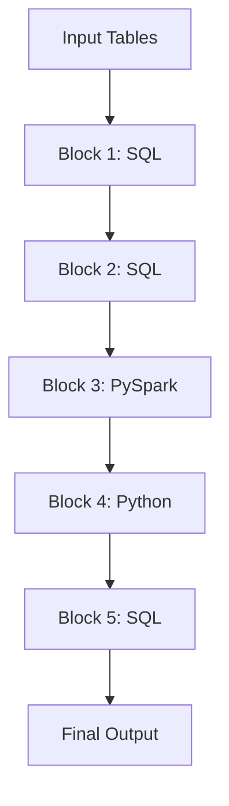

# Mixed Output Template

Template for scripts with blocks routed to multiple translation paths (SQL + PySpark + Python).

---

## Directory Structure

```
{script_name}/
├── {script_name}.sql              # SQL blocks combined
├── {script_name}_etl.py           # PySpark/ETL blocks
├── {script_name}_stats.py         # Python/statistical blocks
├── {script_name}_orchestrator.sql # Execution sequence
└── BLOCK_MAPPING.md               # Traceability
```

---

## Block Mapping Template

```markdown
# Block Mapping: {script_name}.sas

## Summary

| Metric | Value |
|--------|-------|
| Total Blocks | {N} |
| SQL Blocks | {sql_count} |
| PySpark Blocks | {pyspark_count} |
| Python Blocks | {python_count} |

## Block Details

| # | Lines | Type | Path | Output File | Reason |
|---|-------|------|------|-------------|--------|
| 1 | 5-25 | PROC SQL | 🔷 SQL | {script}.sql | Standard query |
| 2 | 27-60 | DATA step | 🔷 SQL | {script}.sql | Simple transform |
| 3 | 62-95 | DATA step | 🐍 PySpark | {script}_etl.py | ARRAY iteration |
| 4 | 97-120 | PROC MEANS | 📊 Python | {script}_stats.py | OUTPUT statement |
| 5 | 122-140 | PROC SQL | 🔷 SQL | {script}.sql | Final output |

## Data Flow


```

---

## Orchestrator Template

```sql
-- ============================================================
-- Orchestrator: {script_name}
-- Generated: {timestamp}
-- Source: {script_name}.sas
-- 
-- This file orchestrates the execution of mixed SQL/Python blocks.
-- Execute blocks in order to maintain data dependencies.
-- ============================================================

USE SCHEMA {target_schema};

-- ============================================================
-- BLOCK 1: SQL (Lines 5-25)
-- Original: PROC SQL - Create base table
-- ============================================================
CREATE OR REPLACE TABLE block1_output AS
SELECT 
    customer_id,
    SUM(amount) AS total_amount
FROM raw_transactions
GROUP BY customer_id;

-- ============================================================
-- BLOCK 2: SQL (Lines 27-60)
-- Original: DATA step - Simple transformation
-- ============================================================
CREATE OR REPLACE TABLE block2_output AS
SELECT 
    *,
    CASE 
        WHEN total_amount > 1000 THEN 'High'
        WHEN total_amount > 500 THEN 'Medium'
        ELSE 'Low'
    END AS customer_tier
FROM block1_output;

-- ============================================================
-- BLOCK 3: PySpark (Lines 62-95)
-- Original: DATA step with ARRAY
-- 
-- EXECUTION: Run {script_name}_etl.py as Snowflake Notebook
--   Option A: EXECUTE NOTEBOOK {schema}.{script_name}_etl;
--   Option B: Deploy as stored procedure and CALL
-- 
-- INPUT:  block2_output
-- OUTPUT: block3_output
-- ============================================================
-- << Execute {script_name}_etl.py >>

-- ============================================================
-- BLOCK 4: Python (Lines 97-120)
-- Original: PROC MEANS with OUTPUT
-- 
-- EXECUTION: Run {script_name}_stats.py as Snowflake Notebook
--   Or deploy statistical function as UDF
-- 
-- INPUT:  block3_output
-- OUTPUT: block4_stats
-- ============================================================
-- << Execute {script_name}_stats.py >>

-- ============================================================
-- BLOCK 5: SQL (Lines 122-140)
-- Original: PROC SQL - Final output
-- ============================================================
CREATE OR REPLACE TABLE final_output AS
SELECT 
    a.*,
    b.avg_amount,
    b.std_amount
FROM block3_output a
LEFT JOIN block4_stats b
    ON a.customer_tier = b.tier;

-- ============================================================
-- Execution Complete
-- ============================================================
SELECT 'Migration complete. Final output: final_output' AS status;
```

---

## SQL File Template (Combined SQL Blocks)

```sql
-- ============================================================
-- SQL Blocks: {script_name}.sas
-- Generated: {timestamp}
-- Blocks: 1, 2, 5 (SQL-translatable)
-- ============================================================

USE SCHEMA {target_schema};

-- ============================================================
-- BLOCK 1 (Lines 5-25): PROC SQL
-- ============================================================
CREATE OR REPLACE TABLE block1_output AS
{translated_sql_1};

-- ============================================================
-- BLOCK 2 (Lines 27-60): DATA step
-- ============================================================
CREATE OR REPLACE TABLE block2_output AS
{translated_sql_2};

-- ============================================================
-- BLOCK 5 (Lines 122-140): PROC SQL
-- Note: Depends on block3_output and block4_stats from Python
-- ============================================================
CREATE OR REPLACE TABLE final_output AS
{translated_sql_5};
```

---

## PySpark File Template (ETL Blocks)

```python
# ============================================================
# PySpark/ETL Blocks: {script_name}.sas
# Generated: {timestamp}
# Blocks: 3 (ETL complexity)
# Reason: ARRAY iteration
# ============================================================

# Cell 1: Setup
from snowflake.snowpark import Session
from snowflake.snowpark.context import get_active_session
from pyspark.sql import SparkSession
from pyspark.sql import functions as F
from pyspark.sql.window import Window

session = get_active_session()
spark = SparkSession.builder.remote(session.connection).getOrCreate()
TARGET_SCHEMA = "{target_schema}"

# Cell 2: Block 3 (Lines 62-95)
# Original SAS:
# DATA block3_output;
#     SET block2_output;
#     ARRAY scores(*) score1-score5;
#     DO i = 1 TO DIM(scores);
#         IF scores(i) < 0 THEN scores(i) = 0;
#     END;
# RUN;

df = spark.read.table(f"{TARGET_SCHEMA}.block2_output")

# ARRAY iteration equivalent
score_cols = ['score1', 'score2', 'score3', 'score4', 'score5']
for col in score_cols:
    df = df.withColumn(col, F.when(F.col(col) < 0, 0).otherwise(F.col(col)))

# Write output
df.write.mode('overwrite').saveAsTable(f"{TARGET_SCHEMA}.block3_output")
print(f"Created {TARGET_SCHEMA}.block3_output")
```

---

## Python File Template (Statistical Blocks)

```python
# ============================================================
# Python/Statistics Blocks: {script_name}.sas
# Generated: {timestamp}
# Blocks: 4 (Statistical complexity)
# Reason: PROC MEANS with OUTPUT
# ============================================================

# Cell 1: Setup
from snowflake.snowpark import Session
from snowflake.snowpark.context import get_active_session
import pandas as pd
import numpy as np

session = get_active_session()
TARGET_SCHEMA = "{target_schema}"

def read_table(name):
    return session.table(f"{TARGET_SCHEMA}.{name}").to_pandas()

def write_table(df, name):
    session.write_pandas(df, name, auto_create_table=True, overwrite=True)

# Cell 2: Block 4 (Lines 97-120)
# Original SAS:
# PROC MEANS DATA=block3_output NOPRINT;
#     VAR amount;
#     BY customer_tier;
#     OUTPUT OUT=block4_stats MEAN=avg_amount STD=std_amount;
# RUN;

df = read_table("block3_output")

stats = df.groupby('customer_tier')['amount'].agg(
    avg_amount='mean',
    std_amount='std',
    n='count'
).reset_index()

write_table(stats, "block4_stats")
print(f"Created {TARGET_SCHEMA}.block4_stats")
```

---

## Deployment Instructions

### Option 1: Sequential Manual Execution

1. Run `{script_name}.sql` blocks 1-2
2. Run `{script_name}_etl.py` as Notebook
3. Run `{script_name}_stats.py` as Notebook
4. Run `{script_name}.sql` block 5

### Option 2: Snowflake Task Orchestration

```sql
-- Create tasks for sequential execution
CREATE OR REPLACE TASK task_sql_blocks_1_2
    WAREHOUSE = my_wh
    AS
    EXECUTE IMMEDIATE FROM @stage/{script_name}.sql;

CREATE OR REPLACE TASK task_etl_block
    WAREHOUSE = my_wh
    AFTER task_sql_blocks_1_2
    AS
    EXECUTE NOTEBOOK {schema}.{script_name}_etl;

CREATE OR REPLACE TASK task_stats_block
    WAREHOUSE = my_wh
    AFTER task_etl_block
    AS
    EXECUTE NOTEBOOK {schema}.{script_name}_stats;

CREATE OR REPLACE TASK task_sql_block_5
    WAREHOUSE = my_wh
    AFTER task_stats_block
    AS
    -- Final SQL block
    CREATE OR REPLACE TABLE final_output AS ...;
```

### Option 3: Stored Procedure Wrapper

```sql
CREATE OR REPLACE PROCEDURE run_{script_name}()
RETURNS STRING
LANGUAGE SQL
AS
$$
BEGIN
    -- Block 1-2: SQL
    CREATE OR REPLACE TABLE block1_output AS ...;
    CREATE OR REPLACE TABLE block2_output AS ...;
    
    -- Block 3: Call PySpark notebook (deployed as sproc)
    CALL {script_name}_etl();
    
    -- Block 4: Call Python stats (deployed as sproc)
    CALL {script_name}_stats();
    
    -- Block 5: SQL
    CREATE OR REPLACE TABLE final_output AS ...;
    
    RETURN 'Complete';
END;
$$;
```
